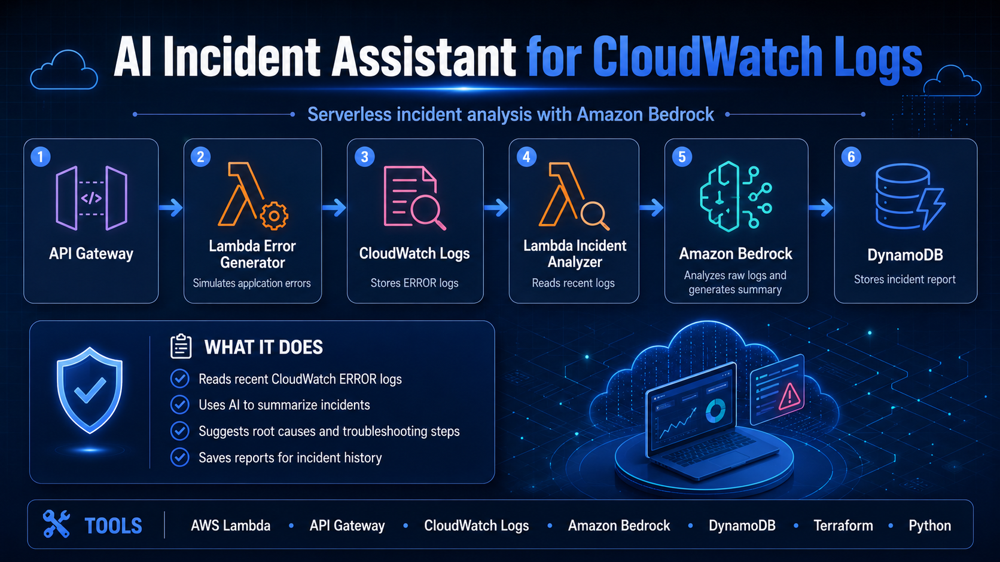

# AI Incident Assistant for CloudWatch Logs



AI-powered incident assistant that analyzes recent CloudWatch error logs with Amazon Bedrock and generates an incident summary, possible root causes, and recommended troubleshooting steps.

## Project Overview

This project demonstrates how generative AI can support cloud incident response.

The system simulates realistic application errors, writes them to Amazon CloudWatch Logs, reads recent ERROR logs with a Lambda-based analyzer, sends the logs to Amazon Bedrock, and stores the generated incident report in DynamoDB.

The goal is to reduce the time Cloud Engineers spend manually reviewing raw logs during the first stage of incident triage.

## Architecture

```text
/generate-error
        |
        v
API Gateway
        |
        v
Error Generator Lambda
        |
        v
CloudWatch Logs


/analyze-incident
        |
        v
API Gateway
        |
        v
Incident Analyzer Lambda
        |
        v
CloudWatch Logs
        |
        v
Amazon Bedrock
        |
        v
DynamoDB